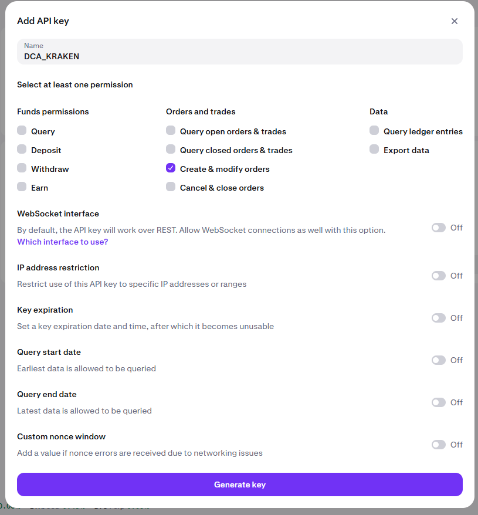

# Kraken DCA Bot

I built this lightweight Python script to reduce fees by using Kraken Pro, while automating my Dollar-Cost Averaging (DCA) strategy. It interacts with the Kraken [API](https://docs.kraken.com/api/docs/rest-api/add-order).

The goal is to keep it as simple as possible so anyone can quickly review and use it.
Run it with Docker and let it handle the rest.

## 🛠 Prerequisites

- A **Kraken account**
- **Kraken API keys** with the proper permissions (Create & modify orders). You can generate them [here](https://pro.kraken.com/app/settings/api#dialog/add-spot-api-key).
- **Docker** or Python



## 📦 Usage

1. Configure variables in `kraken_dca.py`.

```python
api_key = ""
private_key = ""
pair = "XXBTZUSD" # Trading pair. Example: XXBTZUSD = BTC/USD
purchase_price = 10 # buy 10$ of XXX per DCA script execution
```

Find all available pairs here : [Kraken API AssetPairs](https://api.kraken.com/0/public/AssetPairs).

2. Set the DCA schedule

See examples in the [schedule documentation](https://schedule.readthedocs.io/en/stable/)


```
schedule.every().monday.at("14:00", "Europe/Amsterdam").do(buy_crypto)
```

3. Run with docker `docker-compose up -d kraken --build`

⚠️ Important: If you modify the Python file, don’t forget to rerun the build command above.
